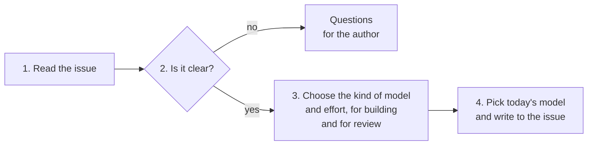

# ai-execution-router

A [Claude Code](https://claude.com/claude-code) skill that reads a GitHub issue and decides how an AI agent should work on it: what kind of model builds it, what kind reviews it, and how hard each one should think. Then it picks today's best model for each job and writes the result on the issue.

## What you get on the issue

Labels:

```text
ai:profile:balanced   ai:workflow:tdd   risk:high
```

And a block at the end of the issue body (shortened here):

```markdown
## AI Execution

Status: Ready

### Implementation
- Profile: Balanced
- Effort: Medium

### Review
- Profile: Frontier Verifier
- Effort: High

### Rationale
- Requirements are clear.
- The work itself is moderate.
- Retries and concurrency hide edge cases.
- A strong, separate review is needed.

### Current Model Resolution
Implementation:
- Provider: <provider>
- Model: <model>
- Reasoning: medium

Review:
- Provider: <provider>
- Model: <model>
- Reasoning: high
```

The top part is permanent. The models at the bottom are picked again on every run, so the issue always points to the best model of the day.

## Why

- **The wrong model costs money or ships bugs.** A top model on a one-line rename is waste. A small model on concurrent message handling misses cases.
- **Some work needs a stronger check.** Code that touches money, security or concurrency deserves a stronger, separate review.
- **Model names go stale.** An issue that says "use model X" is outdated in a few months. The issue stores the kind of model, not the name.

## Quick start

Install:

```bash
git clone https://github.com/VictorMarri/ai-execution-router ~/.claude/skills/ai-execution-router
```

On Windows the folder is `%USERPROFILE%\.claude\skills\ai-execution-router`.

You need Claude Code, the [GitHub CLI](https://cli.github.com/) (`gh`) logged in, and web access for the weekly model list refresh. Without `gh`, paste the issue text and the skill prints what to apply.

Use:

```text
/ai-execution-router #123
/ai-execution-router #123 #124 --strategy cost-aware
/ai-execution-router https://github.com/<owner>/<repo>/issues/42
```

Or just ask: *"which model should implement #42?"*

The skill stops after writing to the issue. Implementing the issue is a separate request.

## How it works



1. **Read the issue**, its comments and the docs it links.
2. **Check that it is clear.** Could an engineer start without guessing? If not, the skill writes questions for the author and stops there. A stronger model does not fix a missing answer.
3. **Choose the kind of model and the effort**, once for building and once for reviewing. The skill rates the issue on a few points (complexity, hidden edge cases, cost of a mistake, scope) and follows written rules.
4. **Pick today's model** for each job from the list of current models, then write the labels and the block on the issue.

When an issue already has a block and has not changed, step 3 is skipped: the skill keeps its earlier choice and only picks the models again.

## An example

Issue: *"Process events with retries and several consumers at the same time."*

- **Build:** balanced model, medium effort. The work itself is ordinary.
- **Review:** the strictest reviewer, high effort. Retries and duplicate events are where bugs hide.
- **Workflow:** TDD. **Risk:** high.

A vague issue, like *"Retry failed deliveries"*, gets questions instead:

- If a call times out after it already did its job, do we retry it or report it?
- Can the same event be processed twice?

## Labels

| Label | Meaning |
|---|---|
| `ai:profile:<role>` | the kind of model that builds it: fast, balanced, frontier or autonomous |
| `ai:workflow:<name>` | the kind of work: tdd, implement, bugfix, investigation, refactor, architecture, review or refinement |
| `risk:low` to `risk:critical` | how bad and how likely a mistake is |
| `ai:needs-refinement` | the issue is not clear yet |
| `ai:tie:impl:<model>`, `ai:tie:review:<model>` | two models are equally good for that job; you pick one |

The skill only touches these labels. Your other labels stay as they are.

**Ties.** Sometimes two models are equally good for a job and nothing separates them. The skill does not stop to ask: it adds one `ai:tie:` label per model, and you choose when you run the issue. To end ties for good, tell it once: *"on ties, prefer <provider>"*.

## Glossary

| Term | Meaning |
|---|---|
| **Role** | The kind of model a job needs: `fast`, `balanced`, `frontier-interactive` (hard work with you in the loop), `frontier-verifier` (strict review) or `deep-autonomous` (long investigation on its own). |
| **Effort** | How hard the model should think: low, medium, high or max. |
| **Review** | A separate session that checks the work, so it verifies instead of agreeing. |
| **Registry** | [`registry/models.yaml`](registry/models.yaml), the list of current models. The only place model names live. It refreshes itself from official docs once a week. |
| **Strategy** | How to pick among good models: `best-fit` (default), `quality-first`, `cost-aware` or `speed-first`. |
| **Refinement** | Answering an issue's open questions before building it. |

## Current status

- **Early version.** It has run on only a few real issues. Expect changes.
- **Nothing is measured yet.** Model choices rest on each provider's own docs. That is why several roles are tied today.
- **Optional evaluation.** You can ask the skill to test models on sample tasks and use the results. It runs only when you ask, and only after you confirm the cost.
- **Two providers** in the registry today. Adding one is one more entry in the registry.

## Details

| To understand | Read |
|---|---|
| The steps of a run | [`SKILL.md`](SKILL.md) |
| How an issue is rated, and risk | [`RUBRIC.md`](RUBRIC.md) |
| How role and effort are chosen | [`ROLES.md`](ROLES.md) |
| How a model is picked, and ties | [`RESOLVER.md`](RESOLVER.md) |
| The registry and its refresh | [`REGISTRY.md`](REGISTRY.md) |
| What is written to GitHub | [`GITHUB.md`](GITHUB.md) |
| Testing models | [`EVALUATOR.md`](EVALUATOR.md), [`eval-packs/`](eval-packs/README.md) |
| Settings | [`registry/models.yaml`](registry/models.yaml), [`eval-packs/config.yaml`](eval-packs/config.yaml) |

These files are written for the agent that runs the skill, so they are dense.

## License

[MIT](LICENSE)
